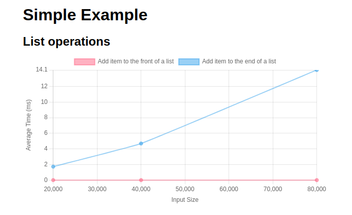

# purescript-benchlib


## Minimal Example
<details>
  <summary>Expand to see module imports</summary>

```purescript
module Test.Samples.Simple where

import Prelude

import BenchLib (bench, benchGroup_, benchSuite, reportConsole)
import BenchLib as BenchLib
import BenchLib.Reporters.ChartJsHtml (reportChartJs_)
import BenchLib.Reporters.Json (reportJson_)
import Data.List (List)
import Data.List as List
import Effect (Effect)
```

</details>


```purescript

main :: Effect Unit
main = do
  let
    mkItems :: Int -> List Int
    mkItems n = List.range 1 n

  BenchLib.run $
    benchSuite
      "Simple Example"

      -- set benchmark suite options by overriding the default config:
      ( \cfg -> cfg
          { -- Define different reporters depending on your needs:
            reporters =
              [ reportConsole -- Logs benchmarks to the console
              , reportJson_ -- Writes benchmarks as JSON to a file
              , reportChartJs_ -- Writes benchmarks as HTML with Chart.js for visualization
              ]

          ,
            -- Sets the number of iterations each benchmark will run:
            iterations = 1000
          ,
            -- Sets input sizes to be passed to the benchmark functions:
            sizes = [ 20_000, 40_000, 80_000 ]
          }
      )
      [
        -- groups benchmarks to be compared:
        benchGroup_ "List operations"
          [ bench
              "Add item to the front of a list"
              -- set benchmark options by overriding the default config:
              ( \cfg -> cfg
                  { prepare = \size -> mkItems size -- runs before each benchmark function
                  }
              )
              -- the benchmark function:
              (\items -> List.Cons 0 items)

          , bench
              "Add item to the end of a list"
              -- set benchmark options by overriding the default config:
              ( \cfg -> cfg
                  { prepare = \size -> mkItems size -- runs before each benchmark function
                  }
              )
              -- the benchmark function:
              (\items -> List.snoc items 0)
          ]
      ]
```

Run the benchmarks in a terminal

```bash
spago run -m Test.Samples.Simple
```

The result will look like:

```bash
• suite: Simple Example
  • group: List operations
    • size: 0
      • bench: Add item to the front of a list (size = 0)
        • mean duration: 0.001 ms (1000 iterations)

      • bench: Add item to the end of a list (size = 0)
        • mean duration: 19.4 ms (1000 iterations)

    • size: 10
      • bench: Add item to the front of a list (size = 10)
        • mean duration: 0.001 ms (1000 iterations)

      • bench: Add item to the end of a list (size = 10)
        • mean duration: 19.266 ms (1000 iterations)

    • size: 100
      • bench: Add item to the front of a list (size = 100)
        • mean duration: 0.0 ms (1000 iterations)

      • bench: Add item to the end of a list (size = 100)
        • mean duration: 19.32 ms (1000 iterations)
```

The visualization will look like:

