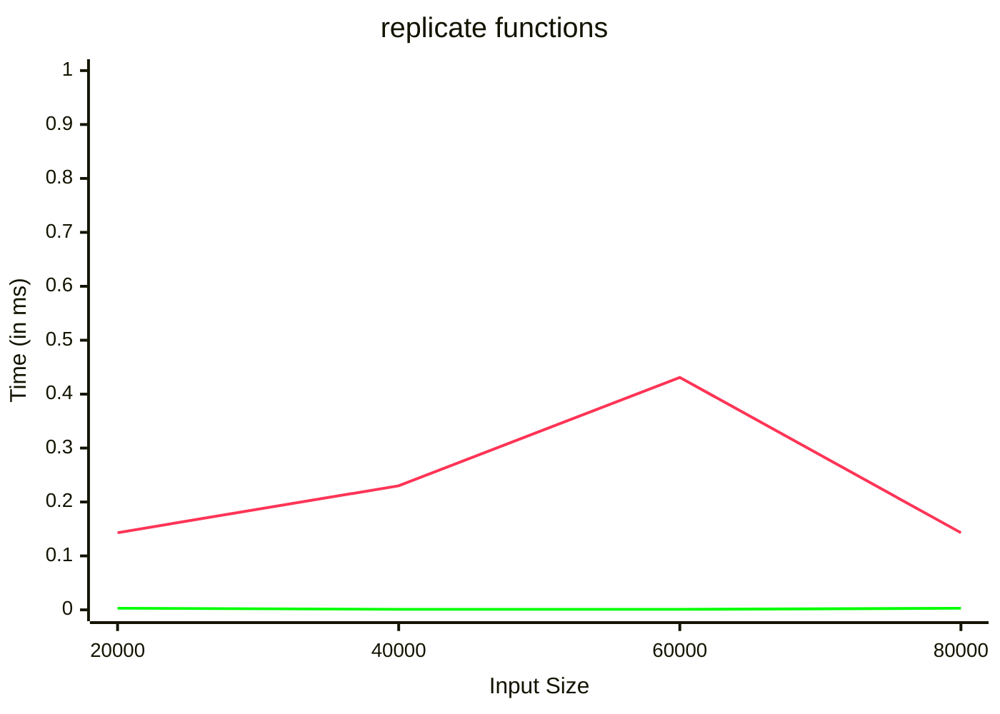

# Minimal Example

```mermaid
---
  config:
    themeVariables:
        xyChart:
            plotColorPalette: "#ff3456, #00ff00, #0000ff, #ffff00, #ff00ff, #00ffff"
---
xychart-beta
  title "replicate functions"
  x-axis "Input Size" [20000, 40000, 60000, 80000]
  y-axis "Time (in ms)" 0 --> 1
  line [0.143, 0.23, 0.431, 0.143, 0.23, 0.431]
  line [0.003, 0.001, 0.001, 0.003, 0.001, 0.001]
```
 array&nbsp;&nbsp; lazy list