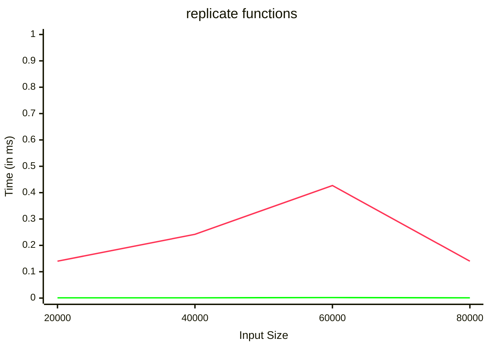

# The benchlib guide

## Configure Reporters

### Define the benchmark in PureScript

<!-- start:code
{ 
  "file": "test/Test/Samples/MarkdownReporter.purs",
  "section": "Header",
  "collapsible": true,
  "link": true
}
-->
[Source Code](test/Test/Samples/MarkdownReporter.purs)
<details>
<summary>Show Module header and imports</summary>

```purescript
module Test.Samples.MarkdownReporter where

import Prelude

import BenchLib (benchGroup_, benchSuite, bench_)
import BenchLib as BenchLib
import BenchLib.Reporters.Markdown (reportMarkdown)
import Data.Array as Array
import Data.List.Lazy as LazyList
import Effect (Effect)
```

</details>
<!-- end -->

<!-- start:code
{"file": "test/Test/Samples/MarkdownReporter.purs", "section": "Main"}
-->

```purescript
main :: Effect Unit
main = BenchLib.run $
  benchSuite
    "Minimal Example"
    ( \cfg -> cfg
        { iterations = 1000
        , sizes = [ 20_000, 40_000, 80_000 ]
        , reporters =
            [ reportMarkdown \def -> def
                { filePath = "docs/MarkdownReporter.md"
                }
            ]
        }
    )
    [ benchGroup_ "replicate functions"
        [ bench_
            "array"
            (\size -> Array.replicate size 'x')

        , bench_
            "lazy list"
            (\size -> LazyList.replicate size 'x')
        ]
    ]
```
<!-- end -->

### Run the benchmark from Command Line

<!-- start:run
{"cmd": "npx spago run --main Test.Samples.MarkdownReporter", "hide": true}
-->
```bash
npx spago run --main Test.Samples.MarkdownReporter
```

<!-- end -->

### View the report

<!-- start:raw
{"file": "docs/MarkdownReporter.md"}
-->


 array&nbsp;&nbsp; lazy list
<!-- end -->
