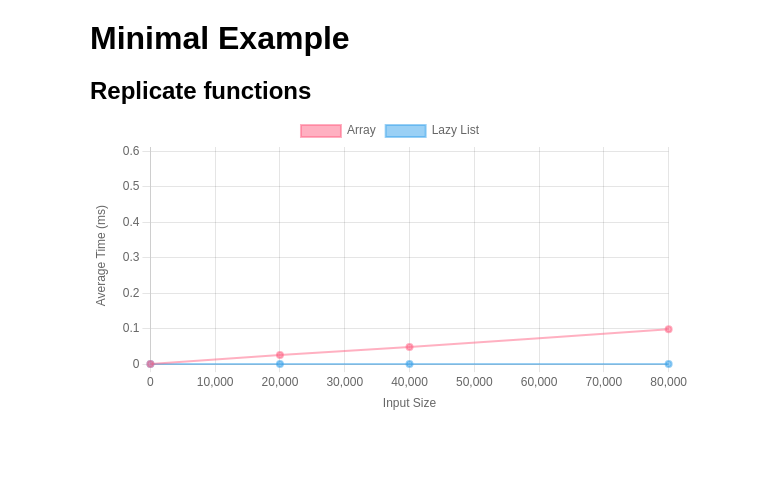

# HTML Reporter

## Configure Reporters

### Define the benchmark in PureScript

<!-- start:pursCode
{ 
  "file": "test/Test/Samples/HtmlReporter.purs",
  "section": "Header",
  "link": true
}
-->
Source Code: [test/Test/Samples/HtmlReporter.purs](test/Test/Samples/HtmlReporter.purs)
> ```purescript
> module Test.Samples.HtmlReporter (main) where
> 
> import Prelude
> 
> import BenchLib (basic, group_, suite, bench_)
> import BenchLib as BenchLib
> import BenchLib.Reporters.Html (reportHtml)
> import Data.Array as Array
> import Data.List.Lazy as LazyList
> import Effect (Effect)
> ```
<!-- end -->

<!-- start:pursCode
{"file": "test/Test/Samples/HtmlReporter.purs", "section": "Main"}
-->

> ```purescript
> reporters :: Array BenchLib.Reporter
> reporters =
>   [ reportHtml \cfg -> cfg
>       { filePath = "docs/outputs/report.html"
>       }
>   ]
> 
> main :: Effect Unit
> main =
>   BenchLib.run
>     ( \cfg -> cfg
>         { reporters = cfg.reporters <> reporters }
>     )
>     $ suite
>         "Minimal Example"
>         ( \cfg -> cfg
>             { iterations = 1000
>             , sizes = [ 0, 20_000, 40_000, 80_000 ]
>             }
>         )
>         [ group_
>             "Replicate functions"
>             [ basic $ bench_
>                 "Array"
>                 (\size -> Array.replicate size 'x')
> 
>             , basic $ bench_
>                 "Lazy List"
>                 (\size -> LazyList.replicate size 'x')
>             ]
>         ]
> ```
<!-- end -->

### Run the benchmark from Command Line

<!-- start:run
{"cmd": "npx spago run --main Test.Samples.HtmlReporter", "hide": true}
-->
```bash
npx spago run --main Test.Samples.HtmlReporter
```


<!-- end -->


<!-- start:run
{
   "cmd": "chromium --headless --disable-gpu --screenshot=docs/chapters/02_reporters/report.png file://{{cwd}}/docs/chapters/02_reporters/report.html", 
   "hide": true,
   "hideCmd": true
}
-->


<!-- end -->


### View the report


