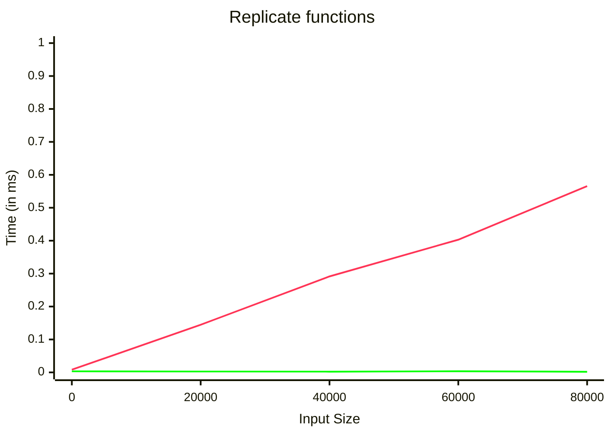

# The benchlib guide

## Configure Reporters

### Define the benchmark in PureScript

<!-- start:pursCode
{ 
  "file": "test/Test/Samples/MarkdownReporter.purs",
  "section": "Header",
  "collapsible": true,
  "link": true
}
-->
Source Code: [test/Test/Samples/MarkdownReporter.purs](test/Test/Samples/MarkdownReporter.purs)
<details>
<summary>Show/Hide imports</summary>

> ```purescript
> module Test.Samples.MarkdownReporter (main) where
> 
> import Prelude
> 
> import BenchLib (basic, group_, suite, bench_)
> import BenchLib as BenchLib
> import BenchLib.Reporters.Markdown (reportMarkdown)
> import Data.Array as Array
> import Data.List.Lazy as LazyList
> import Effect (Effect)
> ```

</details>
<!-- end -->

<!-- start:pursCode
{"file": "test/Test/Samples/MarkdownReporter.purs", "section": "Main"}
-->

> ```purescript
> reporters :: Array BenchLib.Reporter
> reporters =
>   [ reportMarkdown \cfg -> cfg
>       { filePath = "docs/chapters/02_reporters/report.md"
>       , showHeadline = true
>       }
>   ]
> 
> main :: Effect Unit
> main =
>   BenchLib.run
>     ( \cfg -> cfg
>         { reporters = cfg.reporters <> reporters }
>     )
>     $ suite
>         "Minimal Example"
>         ( \cfg -> cfg
>             { iterations = 1000
>             , sizes = [ 0, 20_000, 40_000, 80_000 ]
>             }
>         )
>         [ group_ "Replicate functions"
>             [ basic $ bench_
>                 "Array"
>                 (\size -> Array.replicate size 'x')
> 
>             , basic $ bench_
>                 "Lazy List"
>                 (\size -> LazyList.replicate size 'x')
>             ]
>         ]
> ```
<!-- end -->

### Run the benchmark from Command Line

<!-- start:run
{"cmd": "npx spago run --main Test.Samples.MarkdownReporter", "hide": true}
-->
```bash
npx spago run --main Test.Samples.MarkdownReporter
```


<!-- end -->

### View the report

<!-- start:raw
{"file": "docs/chapters/02_reporters/report.md"}
-->
# Minimal Example

 Array&nbsp;&nbsp; Lazy List
<!-- end -->
